# README

This is the repository template used for student repositories in LAPR Projets.


## Domain Model
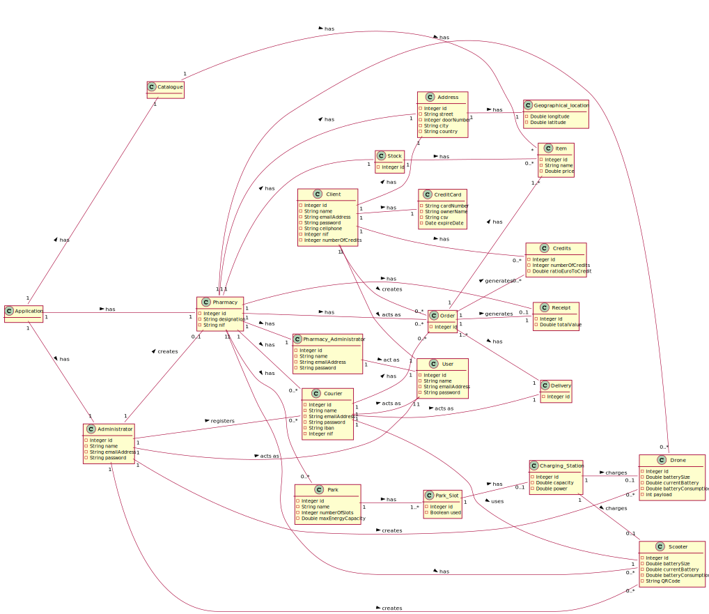

## Relational Model


## Use Cases
### UC1 - Register Client
#### SSD

#### MD

#### SSD

#### CD


### UC2 - Make Order
#### SSD

#### MD
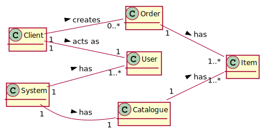
#### SSD
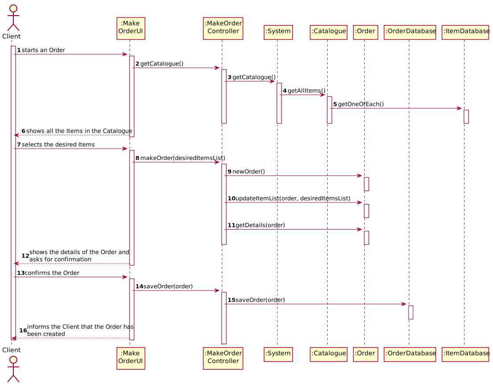
#### CD
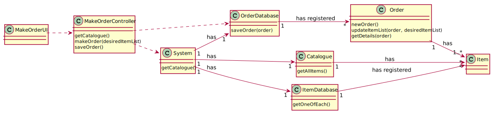

### UC3 - Check Orders Staus
#### SSD

#### MD

#### SSD

#### CD


### UC4 - Check Credits
#### SSD

#### MD
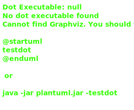
#### SSD

#### CD
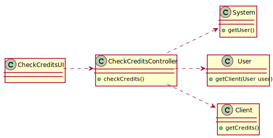

### UC5 - Mark Order as Received
#### SSD

#### MD

#### SSD

#### CD


### UC6 - Courier Login
#### SSD

#### MD

#### SSD


### UC10 - Adminstrator Login
#### SSD

#### MD

#### SSD


### UC16 - Pharmacy Administrator Login
#### SSD

#### MD


### UC17 - Check Order
#### SSD

#### MD

#### SSD

#### CD


### UC18 - Check Stock
#### SSD

#### MD
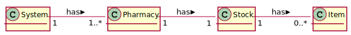
#### SSD
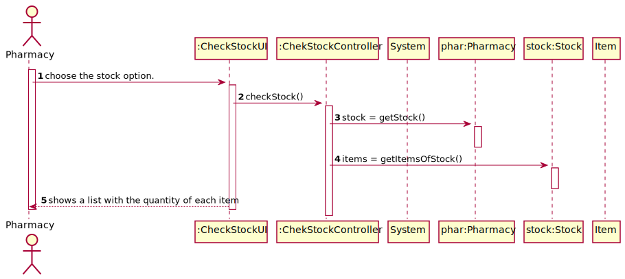
#### CD
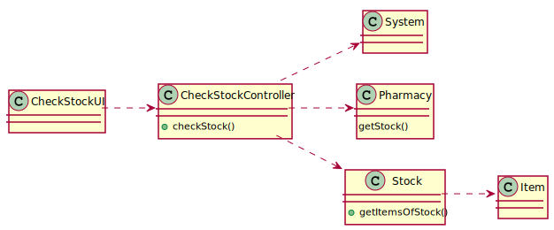

### UC19 - Client Login
#### SSD

#### MD


### UC21 - Check Scooter Battery
#### SSD

#### MD

#### SSD

#### CD


### UC24 - Assign Orders
#### SSD
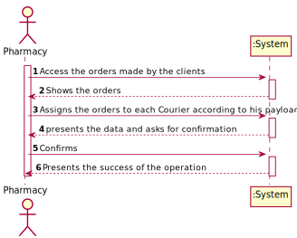
#### MD

#### SSD

#### CD


### UC26 - Shortesth Path
#### SSD
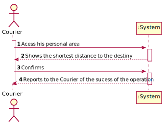
#### MD

#### SSD

#### CD


### UC48 - Energy Consumption
#### SSD

#### MD

#### SSD

#### CD


### UC56 - Add Pharmacy
#### SSD

#### MD

#### SSD


### UC60 - Add Scooter
#### SSD
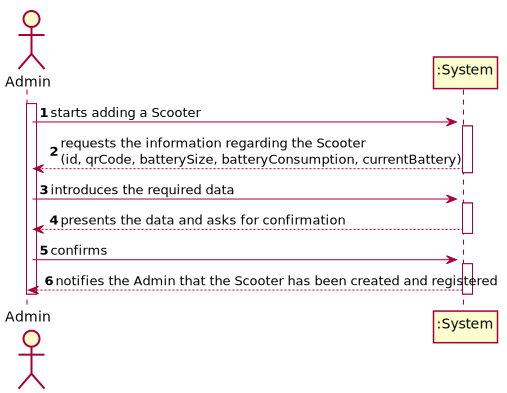
#### MD

#### SSD

#### CD


### UC61 - Remove Scooter
#### SSD

#### MD

#### SSD

#### CD


### UC67 - Check Catalogue
#### SSD

#### MD
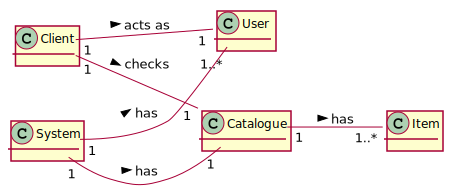
#### SSD
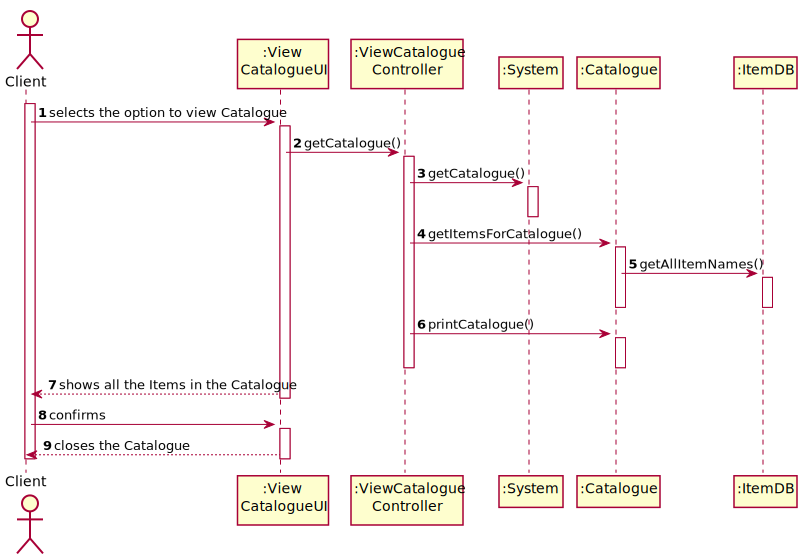
#### CD


### UC68
#### MD


### UC72 - Register Courier
#### SSD
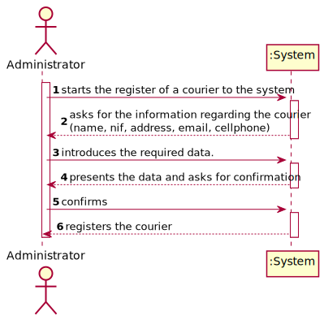
#### MD
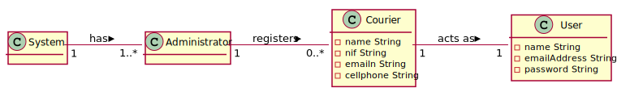
#### SSD
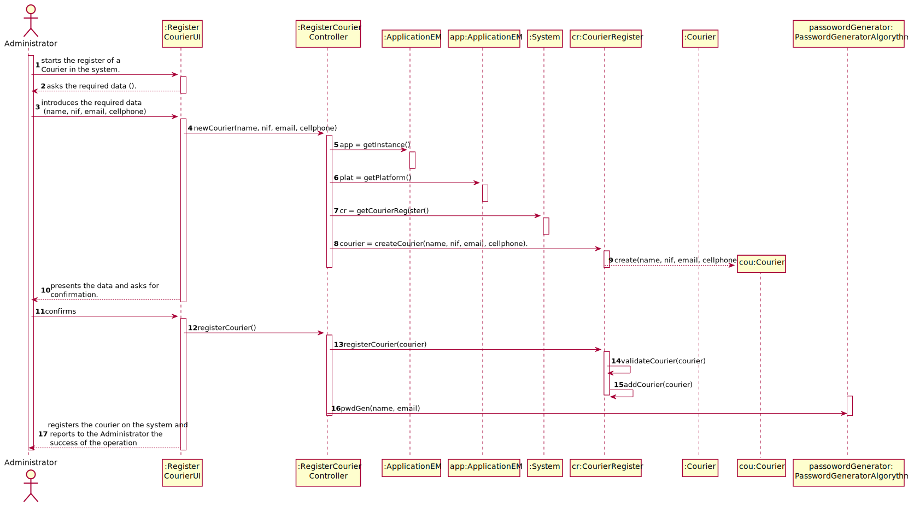
#### CD
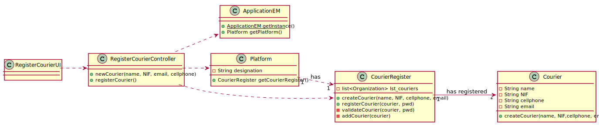

### UC105 - Update Credits
#### SSD

#### MD
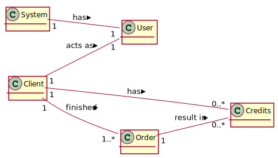
#### SSD

#### CD
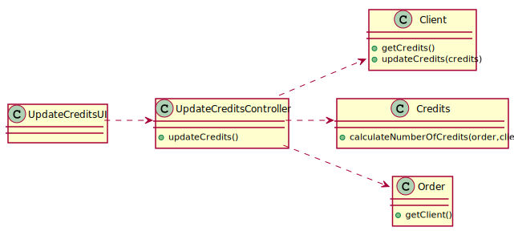

### UC106 - Add Items to Stock
#### SSD

#### MD


### UC107 - Remove Items From Stock
#### SSD

#### MD


### UC108 - Order Cannot Be Fullfilled
#### SSD


### UC109 - Client Item Not IN Cart Notification
#### SSD


### UC110 - Pharmacy Invoice/Receipt
#### SSD

#### MD

#### SSD

#### CD


### UC111 - Clien Invoice/Receipt
#### SSD

#### MD

#### SSD

#### CD


### UC113 - Add ParkSlot and Charging Station to Scooter Park
#### SSD


### UC114 - Add Drone
#### SSD

#### MD

#### SSD

#### CD


### UC115 - Remove Drone
#### SSD

#### SSD

#### CD


### UC117 - Add parkSlot and Charging Station to Drone Park
#### SSD


### UC118 - Delivery Start Notification
#### SSD

#### MD


### UC121 - Nearest Pharmacy
#### SSD

#### MD

#### SSD

#### CD


### UC122 - Send Request Asking for Items to Another Pharmacy
#### SSD

#### MD


### UC124 - Send Request Asking for Items to Another Pharmacy
#### SSD

#### MD


### UC125 - Send request items
#### SSD

#### MD


### UC126 - Distribute Park Energy
#### SSD


### UC127 - Send Scoooter message to Courier
#### SSD


## Java source files

Java source and test files are located in folder src.

## Maven file

Pom.xml file controls the project build.

# Notes
In this file, DO NOT EDIT the following elements:

* groupID
* artifactID
* version
* properties

Beside, students can only add dependencies to the specified section of this file.

## Eclipse files

The following files are solely used by Eclipse IDE:

* .classpath
* .project

## IntelliJ Idea IDE files

The following folder is solely used by Intellij Idea IDE :

* .idea

# How was the .gitignore file generated?
.gitignore file was generated based on https://www.gitignore.io/ with the following keywords:

  - Java
  - Maven
  - Eclipse
  - NetBeans
  - Intellij

# Who do I talk to?
In case you have any problem, please email Nuno Bettencourt (nmb@isep.ipp.pt).

# How do I use Maven?

## How to run unit tests?

Execute the "test" goals.

`$ mvn test`

## How to generate the javadoc for source code?

Execute the "javadoc:javadoc" goal.

`$ mvn javadoc:javadoc`

This generates the source code javadoc in folder "target/site/apidocs/index.html".

## How to generate the javadoc for test cases code?

Execute the "javadoc:test-javadoc" goal.

`$ mvn javadoc:test-javadoc`

This generates the test cases javadoc in folder "target/site/testapidocs/index.html".

## How to generate Jacoco's Code Coverage Report?

Execute the "jacoco:report" goal.

`$ mvn test jacoco:report`

This generates a jacoco code coverage report in folder "target/site/jacoco/index.html".

## How to generate PIT Mutation Code Coverage?

Execute the "org.pitest:pitest-maven:mutationCoverage" goal.

`$ mvn test org.pitest:pitest-maven:mutationCoverage`

This generates a PIT Mutation coverage report in folder "target/pit-reports/YYYYMMDDHHMI".

## How to combine different maven goals in one step?

You can combine different maven goals in the same command. For example, to locally run your project just like on jenkins, use:

`$ mvn clean test jacoco:report org.pitest:pitest-maven:mutationCoverage`

## How to perform a faster pit mutation analysis?

Do not clean build => remove "clean"

Reuse the previous report => add "-Dsonar.pitest.mode=reuseReport"

Use more threads to perform the analysis. The number is dependent on each computer CPU => add "-Dthreads=4"

Temporarily remove timestamps from reports.

Example:

`$ mvn test jacoco:report org.pitest:pitest-maven:mutationCoverage -DhistoryInputFile=target/fasterPitMutationTesting-history.txt -DhistoryOutputFile=target/fasterPitMutationTesting-history.txt -Dsonar.pitest.mode=reuseReport -Dthreads=4 -DtimestampedReports=false`

## Where do I configure my database connection?

Each group should configure their database connection on file: 

* src/main/resources/application.properties

# Oracle repository

If you get the following error:

```
[ERROR] Failed to execute goal on project 
bike-sharing: Could not resolve dependencies for project 
lapr3:bike-sharing:jar:1.0-SNAPSHOT: 
Failed to collect dependencies at 
com.oracle.jdbc:ojdbc7:jar:12.1.0.2: 
Failed to read artifact descriptor for 
com.oracle.jdbc:ojdbc7:jar:12.1.0.2: 
Could not transfer artifact 
com.oracle.jdbc:ojdbc7:pom:12.1.0.2 
from/to maven.oracle.com (https://maven.oracle.com): 
Not authorized , ReasonPhrase:Authorization Required. 
-> [Help 1]
```

Follow these steps:

https://blogs.oracle.com/dev2dev/get-oracle-jdbc-drivers-and-ucp-from-oracle-maven-repository-without-ides

You do not need to set a proxy.

You can use existing dummy Oracle credentials available at http://bugmenot.com.