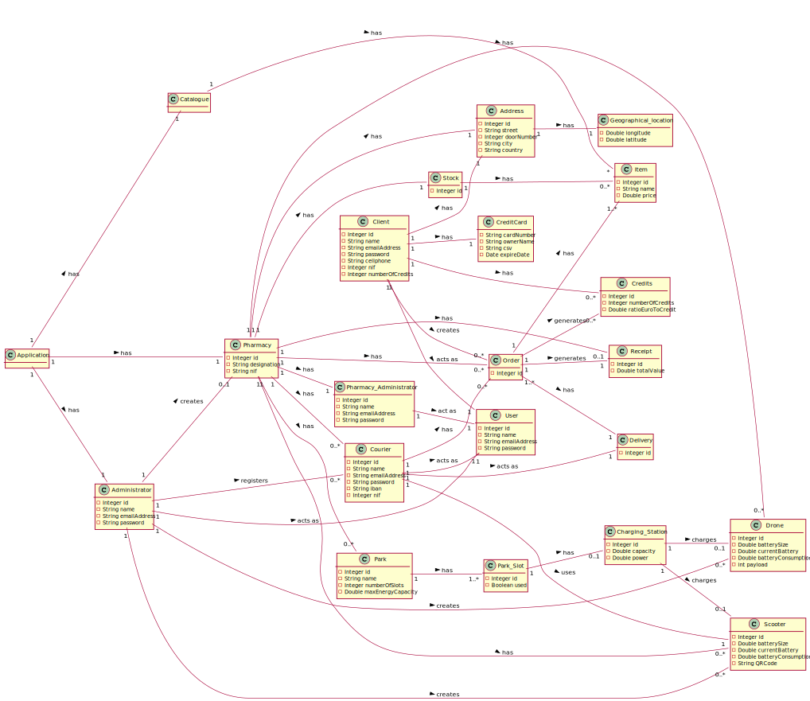

# OO Analysis#
O processo de construção do modelo de domínio é baseado nos casos de uso, em especial os substantivos utilizados, e na descrição do enunciado.
The process of the md creation it's based on the use cases, in special

## Racional para identificação de classes de domínio ##
Para a identificação de classes de domínio usa-se a lista de categorias das aulas TP (sugeridas no livro). Como resultado temos a seguinte tabela de conceitos (ou classes, mas não de software) por categoria.

## Concepts ##

* __Address__ lugar
* __Administrator__ papel de utilizador
* __Catalogue__ catalogo
* __Charging_station__ objeto
* __Client__ papel de utilizador
* __Credits__ transacao
* __Courier__ papel de utilizador
* __Delivery__  transacao
* __Geographical_location__ lugar
* __Item__ produto ou serviço
* __Order__ transacao
* __Park__ conjunto
* __Park_slot__ lugar
* __Pharmacy__  Organizacao
* __Pharmacy_Administrator__ papel de utilizador
* __Receipt__ objeto | transacao
* __Scooter__ objeto
* __Stock__ conjunto
* __Application__ aplicacao
* __User__ papel de utilizador

## **Racional sobre identificação de associações entre classes** ##

| Concept (A) 		|  Association   		|  Concept (B) |
|----------	   		|:-------------:		|------:       |
| Administrator | registers | Courier |
| | creates | Pharmacy |
| | creates | Scooter |
| | acts as | User |
| Catalogue | has | Item |
| Charging_station | charges | Battery |
| Client | creates | Order |
| | has | Address |
| | has | Credits |
| | acts as | User |
| Courier | completes | Delivery |
| | has | Order |
| | uses | Scooter |
| | acts as | User |
| Order | has | Delivery |
| | generates | Receipt |
| | generates | Credits |
| Pharmacy | has | Address |
| | has | Courier |
| | has | Order |
| | has | Park |
| | has | Scooter |
| | has | Stock |
| | has | Pharmacy_Administrator |
| Pharmacy_Administrator | act as | User |
| Park | has | Park_Slot |
| Park_Slot | has | Charging_station |
| Stock | has | Item |
| Application | has | User |
| | has | Pharmacy |
| | has | Catalogue |

## Domain Model

