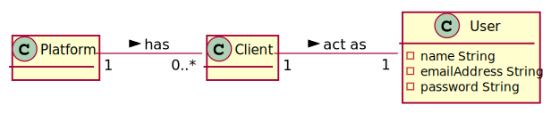
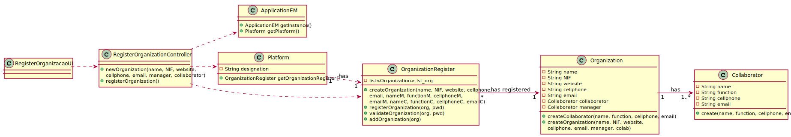

# UC1 - Register Client

## 1. Usability engineering

### Brief Format

The unregistered user starts the client register on the system. The system asks for the information regarding the client (name, nif, address, email, cellphone, credit card information(optional)). The unregistered user introduces the required data. The system validates and presents the client data, asking for confirmation. The client confirms. The system registers the client on the system.

### SSD

### Complete Format

#### Primary Actor
* Unregistered user

#### Stakeholders and interests
* **Pharmacy:**  intends to have clients registered in the system.
* **Unregistered user:** intends to be registered in the system, so that he can acquire the Pharmacy products.

#### Preconditions
n/a

#### Postconditions
* The information about the client is stored in the system.

#### Main success Scenario (or Basic Flow)

1. The unregistered user starts the client register on the system.
2. The system asks for the information regarding the client (name, nif, address, email, cellphone, credit card information(optional) ).
3. The unregistered user introduces the required data.
4. The system validates and presents the client data, asking for confirmation.
5. The client confirms.
6. The system registers the client on the system.

#### Extensions (or Alternative Flows)

*a. The Client cancels the creation.

> The use case ends.

4a. Client's data inserted is invalid.
>	1. The system informs about missing data
>	2. The system allows the reinsertion of the data (step 3)
>
>	    2a. The Unregistered user doesn't reinsert the data. The use case ends.

4b. Missing minimum required data.
>	1. The system informs which data is missing.
>	2. The system allows the reinsertion of the data (step 3)
>
>	    2a. The Unregistered user doesn't reinsert the data. The use case ends.

4c. The system detects that the data (or some subset of the data) entered must be unique and already exists in the system.
>	1. The system alerts the Administrator.
>	2. The system allows the reinsertion of the data (step 3)
>
>	    2a. The Unregistered user doesn't reinsert the data. The use case ends.*

#### Special Requirements
\-

#### Technology and Data Variations List
\-

#### Frequency of Occurence
Everytime there is a new user trying to register himself on the system.

#### Open Issues
* Is there any more required information to create a client besides the already defined?

## 2. OO Analysis

### Partial Domain Model Relevant for the UC

## 3. Design - Use Case Realization

### Rational

| Basic flow | Question: Which class... | Answer | Justification |
|:--------------  |:---------------------- |:----------|:---------------------------- |
|1. The Administrator starts the register of an Organization in the system.|... interacts with the user| RegisterOrganizationUI |Pure Fabrication|
| |... commands the UC?| RegisterOrganizationController |Controller|
|2. The system asks the required data (designation, nif, nameM, emailAddressM, nameC, emailAddressC)||||
|3. The Administrator introduces the required data. |... saves introduced data?|Organization, Collaborator|IE: They have the required data to do the task|
| |... creates Organization instances?|OrganizationRegister|Creator(rule no. 1) & HC+LC. OrganizationRegister is responsible for managing and creating instances of Organization|
| |... creates Collaborator instances?|OrganizationRegister|Creator(rule no. 1) & HC+LC. OrganizationRegister is responsible for managing and creating instances of Collaborator|
|4. The system presents the data and asks for confirmation.|... validates organization data (local validation)|Organization|IE: It has its own data|
| |... validates collaborator data (local validation)|Collaborator|IE: It has its own data|
| |... validates organization data (global validation)|OrganizationRegister|IE: OrganizationRegister has organizations registered|
|5. The Administrator confirms. ||||
|6. The system registers the Organization, reports to the Administrator the success of the operation and sends the password through email.|... saves the organization created?| OrganizationRegister |IE: through the usage of HC+LC on the Platform|
| |... creates the password|PasswordGeneratorAlgorythm|    |

### Systematization ##

 It follows from the rational that the conceptual classes promoted to software classes are:

 * System
 * Client
 * ApplicationEM

Other software classes (i.e. Pure Fabrication) identified:  

 * RegisterClientUI  
 * RegisterClientController
 * ClientRegister

###	Sequence Diagram

###	Class Diagram

