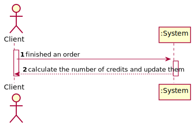
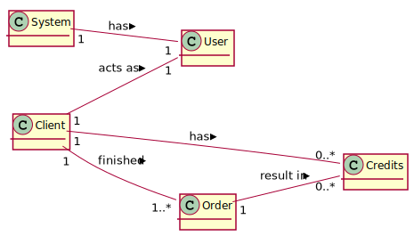
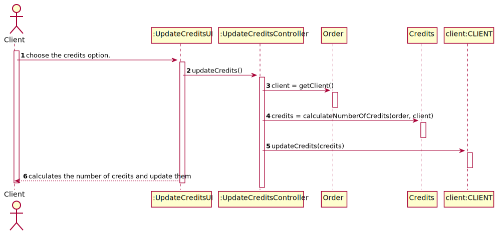
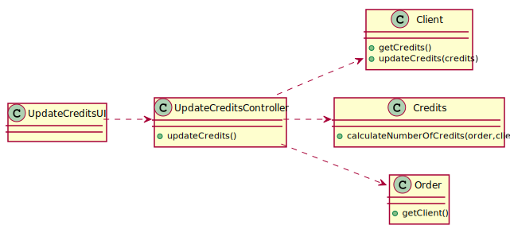

# UC1 - Update Credits

## 1. Usability engineering

### Brief Format

	The Client finish an order. The System calculates the number of credits and update them on client.

### SSD

### Complete Format

#### Primary Actor
* Client

#### Stakeholders and interests
* **Client:** intends to earn credits with the orders.
* **System:** intends that clients earn credits to use them.

#### Preconditions
* The Client must have finished an order.

#### Postconditions
* The credits on Client will be updated.

#### Main success Scenario (or Basic Flow)

1. The Client finish an order.
2. The system calculate the number of credits and update them on client.

#### Extensions (or Alternative Flows)

2a. The number of credits calculated is 0.
>	1. The system does not update the credits on the client.

#### Special Requirements
\-

#### Technology and Data Variations List
\-

#### Frequency of Occurence
Whenever the Client finished an order.

#### Open Issues

## 2. OO Analysis

### Partial Domain Model Relevant for the UC

## 3. Design - Use Case Realization

### Rational

| Basic flow | Question: Which class... | Answer | Justification |
|:--------------  |:---------------------- |:----------|:---------------------------- |
|1. The Client finished an order.|... interacts with the user| UpdateCreditsUI |Pure Fabrication|
| |... commands the UC?| UpdateCreditsController |Controller|
|2. The system calculates the number of credits and update them|... calculates the number of Credits?|Credits||
| |... has the information of the credits of the Client?|Client|
| |... knows the instance of Client?|Order and User|
| |... has the list of users?|System|

### Systematization ##

 It follows from the rational that the conceptual classes promoted to software classes are:

 * System
 * Client
 * Credits
 * User
 * Order

Other software classes (i.e. Pure Fabrication) identified:  

 * UpdateCreditsUI  
 * UpdateCreditsController

###	Sequence Diagram

###	Class Diagram

