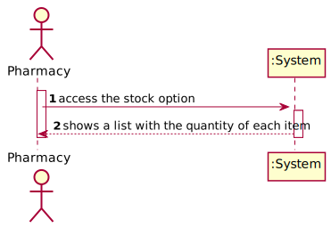
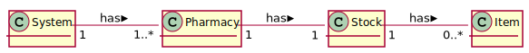
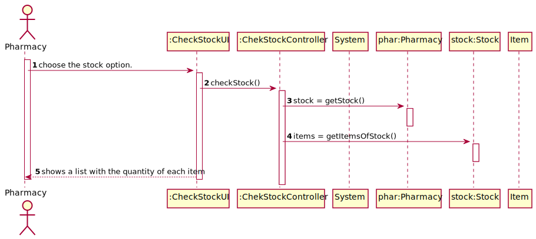
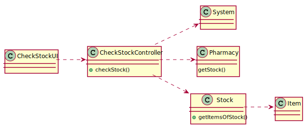

# UC1 - Update Credits

## 1. Usability engineering

### Brief Format

	The pharmacy access the stock option. The system shows a list with the quantity of each item.

### SSD

### Complete Format

#### Primary Actor
* Pharmacy

#### Stakeholders and interests
* **Pharmacy:** intends to check the stock.
* **System:** intends that pharmacy manage the stock.

#### Preconditions
* The pharmacy must be registered on the system.

#### Postconditions
n/a

#### Main success Scenario (or Basic Flow)

1. The pharmacy access the stock option.
2. The system shows a list with the quantity of each item.

#### Extensions (or Alternative Flows)

2a. The are not any items on the pharmacy.
>	1. The system shows an empty list.

#### Special Requirements
\-

#### Technology and Data Variations List
\-

#### Frequency of Occurence
Whenever the Client finished an order.

#### Open Issues

## 2. OO Analysis

### Partial Domain Model Relevant for the UC

## 3. Design - Use Case Realization

### Rational

| Basic flow | Question: Which class... | Answer | Justification |
|:--------------  |:---------------------- |:----------|:---------------------------- |
|1. The pharmacy access stock option.|... interacts with the user| CheckStockUI |Pure Fabrication|
| |... commands the UC?| CheckStockController |Controller|
|2. The system shows the a list with the quantity of each item.|... has the stock information?|Pharmacy||
| |... has the items of the pharmacy?|Stock|
| |... has the information of each item?|Item|

### Systematization ##

 It follows from the rational that the conceptual classes promoted to software classes are:

 * System
 * Pharmacy
 * Stock
 * Item

Other software classes (i.e. Pure Fabrication) identified:  

 * CheckStockUI  
 * CheckStockController

###	Sequence Diagram

###	Class Diagram

