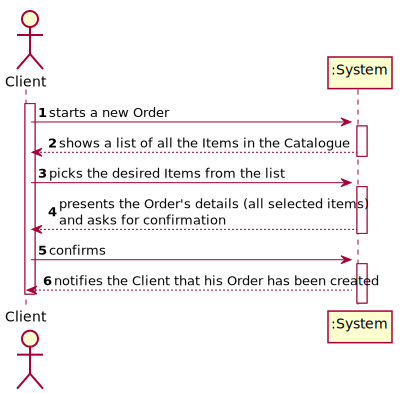
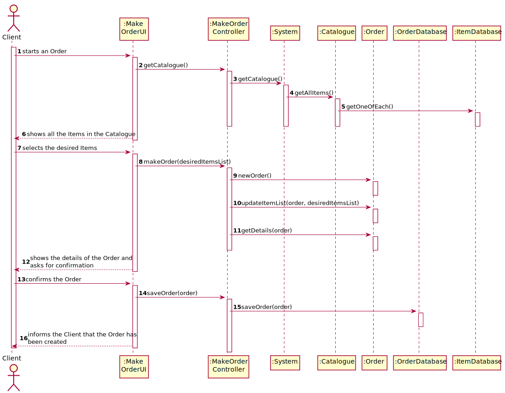
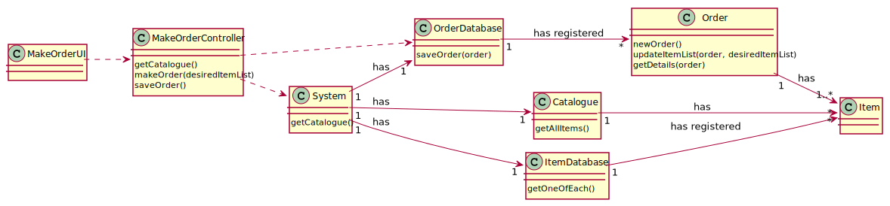

# UC5 - Make Order

## 1. Usability engineering

### Brief Format

	The Client starts a new Order, the System shows the Client a list of all the available Items from the Catalogue, the Client picks the desired Items from the list, the System presents the details of the Order (all the Items the Client selected), and asks for confirmation, the Client confirms, the System notifies the Client about that the Order has been created successfully.

### SSD

### Complete Format

#### Primary Actor
* Client

#### Stakeholders and interests
* **Client:** intends to create a new Order.
* **Pharmacy:** intends to receive the Order.
* **System:** intends to update the database of Orders.

#### Preconditions
* n/a

#### Postconditions
* The Order has to be created and sent to a Pharmacy.
* The Order has to be stored in a database.

#### Main success Scenario (or Basic Flow)

1. The Client starts making an Order.
2. The System shows a list of all the Items in the Catalogue.
3. The Client picks the desired Items from the list.
4. The System presents the Order's details (all selected Items) and asks for confirmation.
5. The Client confirms.
6. The System notifies the Client that his Order has been created.

#### Extensions (or Alternative Flows)

*. The Client exits the creation of a new Order.

> The use case ends.

4a. The Client doesn't select any Items.
>	1. The user can go back to the list of Items
>	2. The system allows the selection Items (step 3)

6a. The Client doesn't confirm.
>	1. The user can go back to the list of Items
>	2. The system allows the selection Items (step 3)

#### Special Requirements
\-

#### Technology and Data Variations List
\-

#### Frequency of Occurence
Whenever the Client wants to make a new Order.

#### Open Issues
* Are there any more requirements to consider when making an Order?

## 2. OO Analysis

### Partial Domain Model Relevant for the UC

## 3. Design - Use Case Realization

### Rational __F A L T A    I S T O__

| Basic flow | Question: Which class... | Answer | Justification |
|:--------------  |:---------------------- |:----------|:---------------------------- |
|||||
|||||
|||||
|||||
|||||
|||||
|||||
|||||
|||||

### Systematization ##

 It follows from the rational that the conceptual classes promoted to software classes are:

 * User
 * System
 * Client
 * Catalogue
 * Order
 * Item

Other software classes (i.e. Pure Fabrication) identified:  

 * MakeOrderUI  
 * MakeOrderController
 * OrderDatabase
 * ItemDatabase

###	Sequence Diagram

###	Class Diagram

