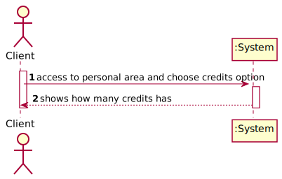

# UC4 - Check Credits

## 1. Usability engineering

### Brief Format

	The Client access to personal area and choose credits option. The system show how many credits has.

### SSD

### Complete Format

#### Primary Actor
* Client

#### Stakeholders and interests
* **Client:** intends to check how many credits has.
* **System:** intends that clients use credits.

#### Preconditions
* The Client must be registered on the system.

#### Postconditions
n/a

#### Main success Scenario (or Basic Flow)

1. The Client choose credits option.
2. The system shows how many credits the Client has.

#### Extensions (or Alternative Flows)

2a. Client does not have any credits.
>	1. The system informs the client that there are not credits.

#### Special Requirements
\-

#### Technology and Data Variations List
\-

#### Frequency of Occurence
Whenever the Client wants check credits.

#### Open Issues

## 2. OO Analysis

### Partial Domain Model Relevant for the UC

## 3. Design - Use Case Realization

### Rational

| Basic flow | Question: Which class... | Answer | Justification |
|:--------------  |:---------------------- |:----------|:---------------------------- |
|1. The Client access personal are and choose credits option.|... interacts with the user| CheckCreditsUI |Pure Fabrication|
| |... commands the UC?| CheckCreditsController |Controller|
|2. The system shows how many credits the client has|... has the information of Credits?|Credits||
| |... has the information of the credits of the Client?|Client|
| |... knows the instance of Client?|User|
| |... has the list of users?|System|

### Systematization ##

 It follows from the rational that the conceptual classes promoted to software classes are:

 * System
 * Client
 * Credits
 * User

Other software classes (i.e. Pure Fabrication) identified:  

 * CheckCreditsUI  
 * CheckCreditsController

###	Sequence Diagram

###	Class Diagram

