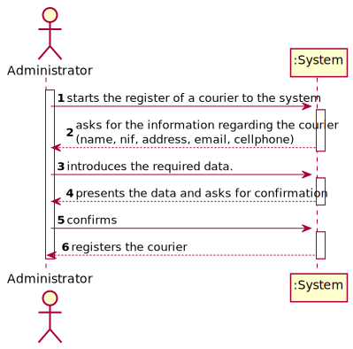
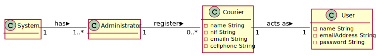
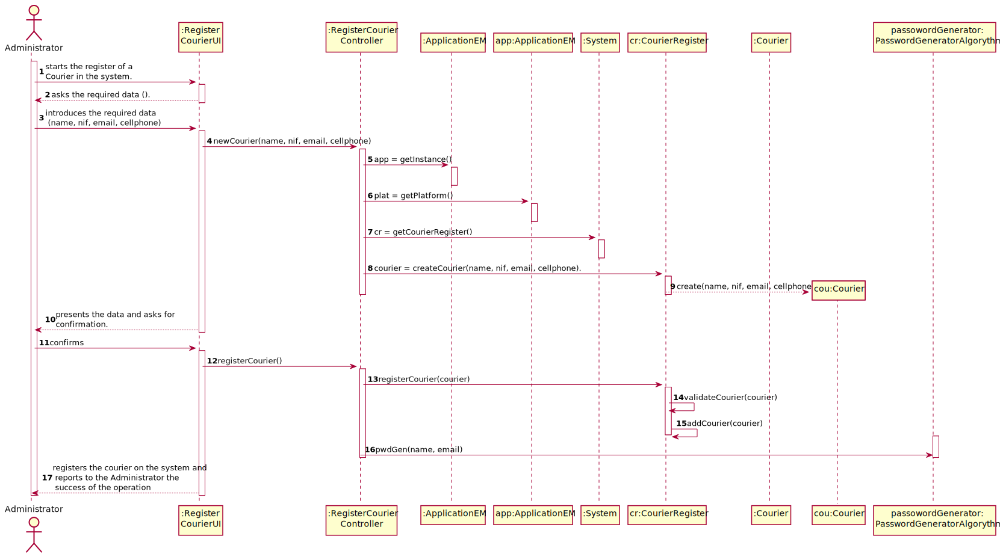
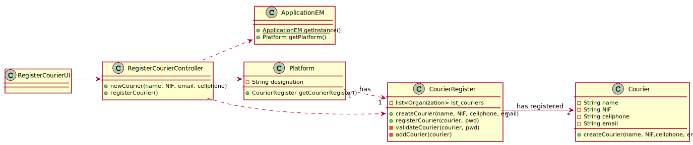

# UC72 - Register Courier

## 1. Usability engineering

### Brief Format

The Administrator starts the courier register on the system. The system asks for the information regarding the courier (name, nif, address, email, cellphone). The Administrator introduces the required data. The system validates and presents the Courier data, asking for confirmation. The Administrator confirms. The system registers the courier on the system.

### SSD

### Complete Format

#### Primary Actor
* Administrator

#### Stakeholders and interests
* **Pharmacy:**  intends to have couriers registered in the system.
* **Courier:** intends to be registered in the system, so that he can delivery orders.

#### Preconditions
n/a

#### Postconditions
* The information about the courier is stored in the system.

#### Main success Scenario (or Basic Flow)

1. The Administrator starts the courier register on the system.
2. The system asks for the information regarding the courier (name, nif, address, email, cellphone).
3. The Administrator introduces the required data.
4. The system validates and presents the courier data, asking for confirmation.
5. The Administrator confirms.
6. The system registers the courier on the system.

#### Extensions (or Alternative Flows)

*a. The Administrator cancels the creation.

> The use case ends.

4a. Courier's data inserted is invalid.
>	1. The system informs about missing data
>	2. The system allows the reinsertion of the data (step 3)
>
>	    2a. The Unregistered user doesn't reinsert the data. The use case ends.

4b. Missing minimum required data.
>	1. The system informs which data is missing.
>	2. The system allows the reinsertion of the data (step 3)
>
>	    2a. The Administrator doesn't reinsert the data. The use case ends.

4c. The system detects that the data (or some subset of the data) entered must be unique and already exists in the system.
>	1. The system alerts the Administrator.
>	2. The system allows the reinsertion of the data (step 3)
>
>	    2a. The Administrator doesn't reinsert the data. The use case ends.*

#### Special Requirements
\-

#### Technology and Data Variations List
\-

#### Frequency of Occurence
Whenever the Administrator intends to register a courier

#### Open Issues
\-

## 2. OO Analysis

### Partial Domain Model Relevant for the UC

## 3. Design - Use Case Realization

### Rational

| Basic flow | Question: Which class... | Answer | Justification |
|:--------------  |:---------------------- |:----------|:---------------------------- |
|1. The Administrator starts the register of a Courier on the system.|... interacts with the user| RegisterCourierUI |Pure Fabrication|
| |... commands the UC?| RegisterCourierController |Controller|
|2. The system asks for the information regarding the courier (name, nif, email, cellphone).||||
|3. The Administrator introduces the required data. |... saves introduced data?| Courier |IE: They have the required data to do the task|
| |... creates courier instances?|CourierRegister|Creator(rule no. 1) & HC+LC. CourierRegister is responsible for managing and creating instances of Courier|
|4. The system validates and presents the Courier data, asking for confirmation.|... validates courier data (local validation)|Courier|IE: It has its own data|
| |... validates Courier data (global validation)|CourierRegister|IE: CourierRegister has couriers registered|
|5. The Administrator confirms. ||||
|6.  The system registers the courier on the system.|... saves the courier created?| CourierRegister |IE: through the usage of HC+LC on the System|
| |... creates the password|PasswordGeneratorAlgorythm|    |

### Systematization ##

 It follows from the rational that the conceptual classes promoted to software classes are:

 * System
 * Courier
 * Administrator
 * User

Other software classes (i.e. Pure Fabrication) identified:  

 * RegisterCourierUI  
 * RegisterCourierController
 * CourierRegister

###	Sequence Diagram

###	Class Diagram

